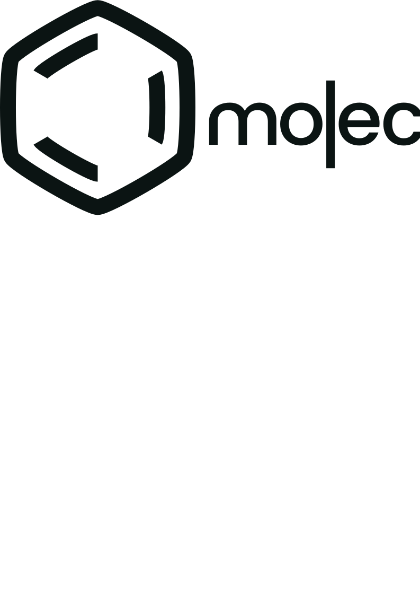

[](./LICENSE)
[](https://github.com/OpenSmock/Molecule/actions/workflows/Pharo11CI.yml)
[](https://github.com/OpenSmock/Molecule/actions/workflows/Pharo12CI.yml)

# Molecule


Molecule is a component oriented framework for Pharo. 
His Component architecture approach provide an adapted structuration to graphic user interface (GUI) or another software application wich need Component features.

Molecule provide a way to describe a software application as a components group. Components communicate by use of services, parameters and events propagation. It is a Pharo implementation of the Lightweight Corba Component Model (Lightweight CCM).
Molecule support completely transparent class augmentation into component (not necessary to add code manually), based on Traits.

## Getting Started

### Installing Molecule

```smalltalk
Metacello new
   baseline: 'Molecule';
   repository: 'github://OpenSmock/Molecule';
   load.
```

Continuous integration (CI) status badges show status of compatibility all supported Pharo versions. You can use Molecule with your Pharo version when its badge is green ! 

### Looking for an older Pharo ?

New releases of Molecule not support old Pharo versions (< 10), but may be works.
Find below some Molecule branches for old Pharo versions. 

[Pharo 9 and 10 - last release is 1.2.8](https://github.com/OpenSmock/Molecule/tree/Pharo9-10).

[Pharo 8 - last release is 1.2.7](https://github.com/OpenSmock/Molecule/tree/Pharo8).

[Pharo 6 and 7 - last release is 1.1.1](https://github.com/OpenSmock/Molecule/tree/Pharo6-7).

### Prerequisites

Molecule Core has no dependencies.

Package 'Molecule-Benchmarks' requires SMark (https://github.com/smarr/SMark), this package contains benchmarks for working on performances.

## Molecule Menu


Molecule system can be monitored and controlled from the dedicated `Molecule` library menu.

## Using Components

### Start and stop method

Components can be used with the start & stop method.

To start a component :

```smalltalk
component := MyComponentClass start.
```

To stop a component : 

```smalltalk
MyComponentClass stop.
```

Component can be identified with a name. To start a component with a specific name :

```smalltalk
componentA := MyComponentClass start: #componentA.
```

To stop a component identified by a name.

```smalltalk
MyComponentClass stop: #componentA.
```

### Component Life-cycle method

Components can be used with the life-cycle method, the two methods (start & stop, life-cycle) can be combined.

Start a component is equivalent to :

```smalltalk
MyComponentClass deploy.
component := MyComponentClass instanciate.
MyComponentClass activate.
```

With a name :

```smalltalk
MyComponentClass deploy.
componentA := MyComponentClass instanciate: #compA.
MyComponentClass activate: #compA.
```

Stop a component is equivalent to :

```smalltalk
MyComponentClass passivate.
MyComponentClass remove.
MyComponentClass undeploy.
```

With a name :

```smalltalk
MyComponentClass passivate: #compA.
MyComponentClass remove: #compA.
MyComponentClass undeploy.
```

## Some examples

Examples are available in the package 'Molecule-Examples'.
Before running examples open the Transcript, some results are showed on the Transcript window.

#### Clock System example

```smalltalk
MolMyClockSystem startAlarmExample.
```

This system uses 4 components: a server time send global hour to a clock. The clock send local hour to alarms and to final user (which could be an UI). The final user can change the parameters of the system as alarm time or set manual time for the clock. The alarm is subscribed to clock time, and sounds when it is time.

This system provides a global example of the use of components. 

#### GPS example

```smalltalk
MolGPSExampleLauncher start.
```
More details about examples in the comment of MolGPSExampleLauncher.

First we program a component application that connects to a Global Positioning System (GPS) hardware and displays the GPS data on a view map (just fictitious).
The GPS data and view map are implemented as Molecule components.
In a second way, we reuse an existing non-component class in our Molecule application (MolGPSHardware).
To do so, we augment this class with component behavior.


## Incubator packages : our UI tools experimentation zone

UI Tools are comming in next versions of Molecule. They are currently in development in incubators packages but are ready to use (may be instable).


### Installing incubators packages :

```smalltalk
Metacello new
   baseline: 'MoleculeIncubator';
   repository: 'github://OpenSmock/Molecule';
   load.
```

## To know more...

Publications related to Molecule.

[Molecule: live prototyping with component-oriented programming](https://inria.hal.science/hal-02966704/)

[15 Years of Reuse Experience in Evolutionary Prototyping for the Defense Industry](https://inria.hal.science/hal-02966691/preview/ICSR_15years.pdf)

[Reuse in component-based prototyping: an industrial experience report from 15 years of reuse](https://link.springer.com/article/10.1007/s11334-022-00456-4)

## Credits

* **Pierre Laborde** - *Initial work* - [labordep](https://github.com/labordep)
* **Eric Le Pors** - *Initial work* - [ELePors](https://github.com/ELePors)
* **Nolwenn Fournier** - *Initial work* - [nolwennfournier](https://github.com/nolwennfournier)
* **Alain Plantec** - *Initial work* - [plantec](https://github.com/plantec)
* **Lisa Doyen** - *UI Components Tools* - [lisadoyen](https://github.com/lisadoyen)



## License

This project is licensed under the MIT License - see the [LICENSE](LICENSE) file for details.
